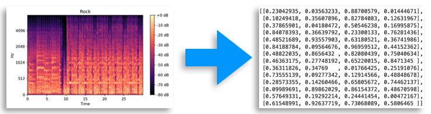
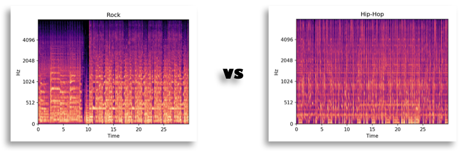
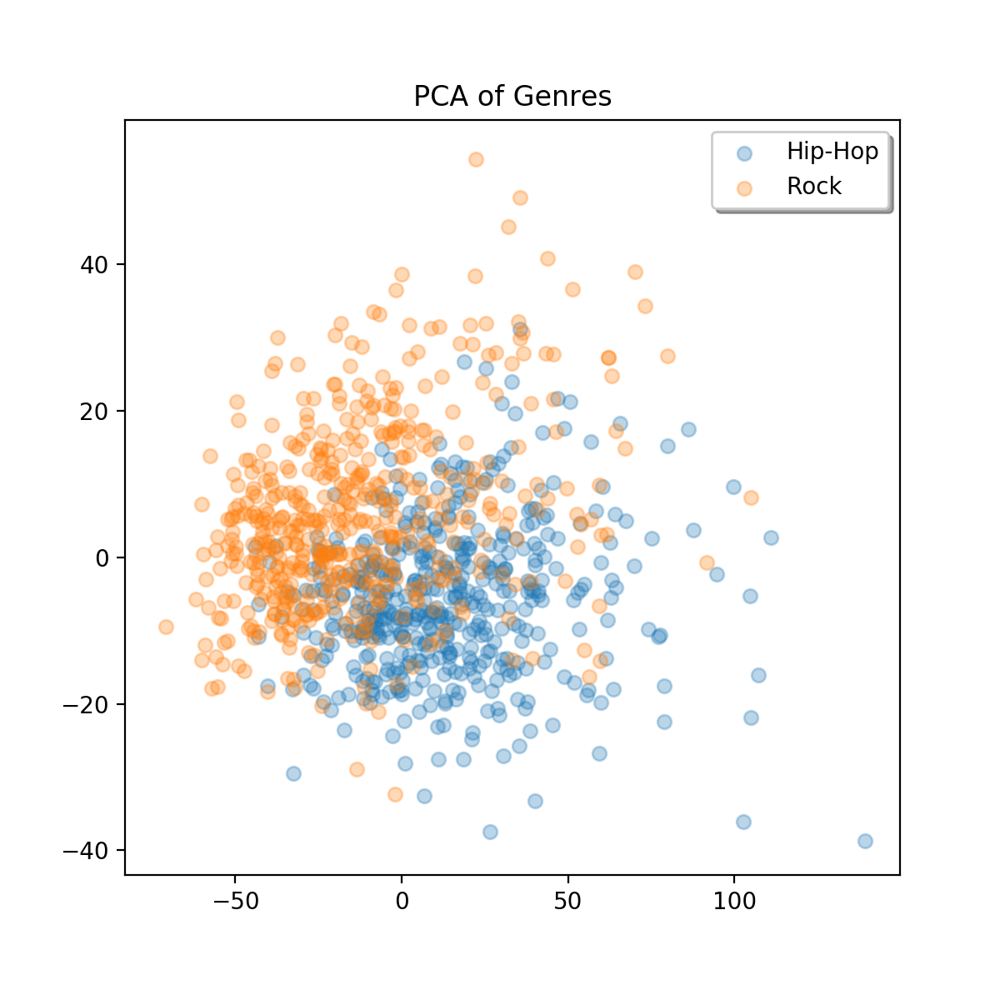
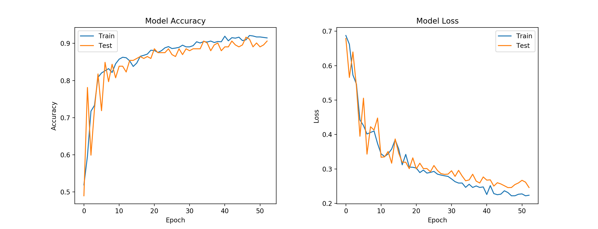
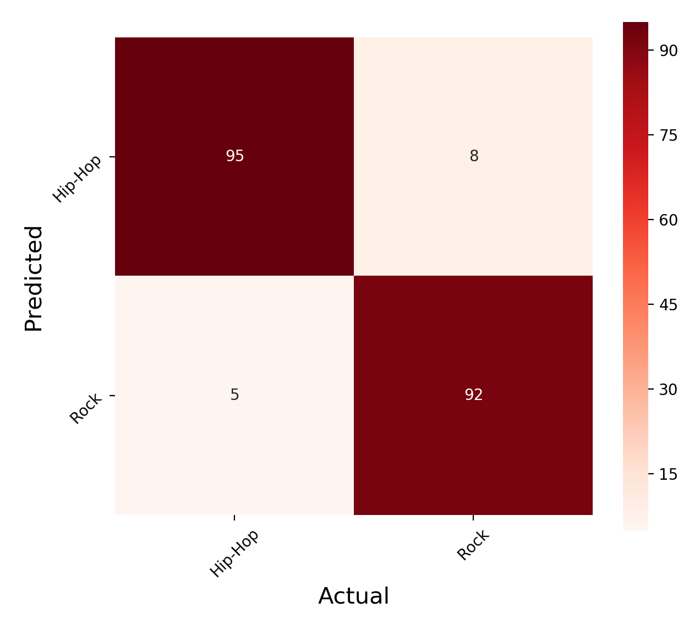

# Music Classification with a Convolutional Neural Network
This project explores the application of a CNN to audio, using 2D Convolutions. This endeavor falls under the science of Music Information Retrieval (MIR), which has some well-known applications in Recommender Systems (Spotify) and Audio Identification (Shazam).

## Data
The data comes from the [Free Music Archive](https://github.com/mdeff/fma) open-benchmark dataset. I used the pre-defined "Small" subset, which offers 8000 30-second clips, balanced oer 8 root genres.

## Convolutional Neural Networks
CNNs are best known for their state of the art performance on image classification. To achieve this, they use a series of filters to scan the image for features, and at each layer of the network, more complex features are found.

The networks sees images as arrays of numbers, with each number representing a pixel value.

In order to use this network with audio, it must first be converted to a format similar to an image. The melspectrogram offers such a format, where the numbers in the array represent decibel ratings at each timestep and frequency.

## Rock vs. Hip-Hop

Before we train the model, we can reduce the arrays to 2 principal components and plot them, to see that the genres do tend to cluster.

