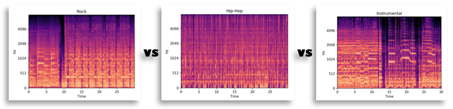

# Music Classification with a Convolutional Neural Network
This project explores the application of a CNN to audio using 2D Convolutions. This endeavor falls under the science of Music Information Retrieval (MIR), which has some well-known applications in Recommender Systems (Spotify) and Audio Identification (Shazam). 
[This video](https://youtu.be/lm5Pmkzw6Bs) gives a brief overview, similar to the README.

# Table of Contents
[Data](#data) 
[Technology](#tech) 
[Intro to CNNs](#CNNs) 
[Results](#results) 
[Conclusion](#conclusion) 
[Navigating the repo / Reproducing the results](#nav) 

---
---

## Data
The data comes from the [Free Music Archive](https://github.com/mdeff/fma) open-benchmark dataset.  
I used the pre-defined "Small" subset, which offers 8000 30-second clips balanced over 8 root genres.

## Technology
This project used Tensorflow2.0/Keras running on GPUs hosted on Amazon Web Services and employed the standard Python Data Science stack, with the inclusion of [Librosa](https://librosa.github.io/librosa/) for the audio conversion.

  

## Convolutional Neural Networks
CNNs are best known for their state of the art performance on image classification. To achieve this, they use a series of filters to scan the image for features, and at each layer of the network more complex features are found.

The networks sees images as arrays of numbers, with each number representing a pixel value.

  

In order to use this network with audio, it must first be converted to a format similar to an image. The [melspectrogram](https://towardsdatascience.com/getting-to-know-the-mel-spectrogram-31bca3e2d9d0) offers such a format, where the numbers in the array represent decibel ratings at each timestep and frequency.

  

## Results
### Rock vs. Hip-Hop
The first test was to see how the network distinguishes between Rock and Hip-Hop.

  

Before training the model, the arrays were reduced to 2 principal components and plotted, showing that the genres cluster reasonably.

  

After training on 800 examples of each genre, the model achieved 94% accuracy on a balanced test set of 200.

  
  

### Rock vs. Hip-Hop vs. Instrumental

  
  When I introduced the more ambiguous genre of ‘Instrumental’ into the mix, there was more overlap in the plotting.
  

After adding the new tracks to the network, accuracy dropped to 84% and struggled most with the instrumental genre.
  
  
  

I listened to the misclassified clips to see what they sounded like.  
Since I can't embed the clips in the README, I'll just point out that the instrumental clips *do* resemble other genres. In one particular example where the model's prediction was 94% Hip-Hop, the "Instrumental" clip contained a sample of a human voice talking over a beat, which very much resembled Hip-Hop. 

These broad, subjective labels seem to be hard for the network to learn.

## Conclusion
* High-level metadata can be extracted from an audio signal
* The CNN filters are able to learn the distinguishing features of broad genre classifications
* The network can only be as good as our subjective labeling system
* Looking into the misclassified examples can be very informative about your model and your data

## Next Steps
* Make scripts configurable
* Continue to add more genres, including lower-level sub-genres from the full dataset
* Replicate the architecture of a state of the art image classification model
* Compare to other networks, such as Conv1D to LSTM

---
---

## Reproducing the results
*Specifically the three-genre model (Rock, Hip-Hip, Instrumental)

### Environment
1. Create conda environment from [linux_environment.yml](linux_environment.yml) or [mac_environment.yml](mac_environment.yml)

### Download and convert audio
2. cd into `src/` and run the following from inside the directory 
    1. [download_small.sh](src/download_small.sh)
    2. [convert.py](src/convert.py) [genres separated by space]
        1. `$ python convert.py Rock Hip-Hop Instrumental`

### Run model
3. From root directory, run [model4.py](model4.py)
    1. This will save the weights from the best epoch (monitoring val_loss), as well as plots of the training accuracy/loss and the confusion matrix into `models/`
