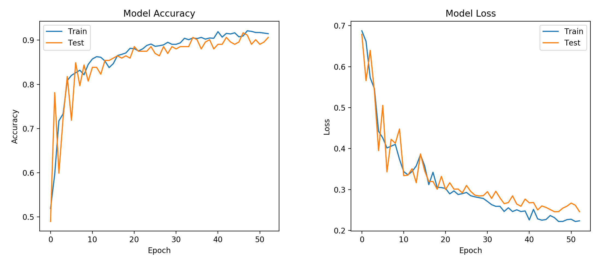

# Music Classification with a Convolutional Neural Network
This project explores the application of a CNN to audio, using 2D Convolutions. This endeavor falls under the science of Music Information Retrieval (MIR), which has some well-known applications in Recommender Systems (Spotify) and Audio Identification (Shazam).

---

# Table of Contents
[Data](#data) 
[Technology](#tech) 
[Intro to CNNs](#CNNs) 
[Results](#results) 

---

## Data
The data comes from the [Free Music Archive](https://github.com/mdeff/fma) open-benchmark dataset.  
I used the pre-defined "Small" subset, which offers 8000 30-second clips, balanced over 8 root genres.

## Technology
This project used Tensorflow2.0/Keras running on GPUs hosted on Amazon Web Services, and employed the standard Python Data Science stack, with the inclusion of [Librosa](https://librosa.github.io/librosa/) for the audio conversion.

  

## Convolutional Neural Networks
CNNs are best known for their state of the art performance on image classification. To achieve this, they use a series of filters to scan the image for features, and at each layer of the network, more complex features are found.

The networks sees images as arrays of numbers, with each number representing a pixel value.

  

In order to use this network with audio, it must first be converted to a format similar to an image. The [melspectrogram](https://towardsdatascience.com/getting-to-know-the-mel-spectrogram-31bca3e2d9d0) offers such a format, where the numbers in the array represent decibel ratings at each timestep and frequency.

  

## Results
### Rock vs. Hip-Hop
The first test was to see how the network distinguishes between Rock and Hip-Hop.

  

Before training the model, the arrays were reduced to 2 principal components and plotted, showing that the genres cluster.

  

After training on 800 examples of each genre, the model achieved 94% accuracy on a balanced test set of 200.

  
  

### Rock vs. Hip-Hop vs. Instrumental

  
  
  When I introduced the more ambiguous genre of ‘Instrumental’ into the mix, there was more overlap in the plotting.

  

After adding the new tracks to the network, accuracy dropped to 84%, and struggled most with the instrumental genre.
  
  
  

